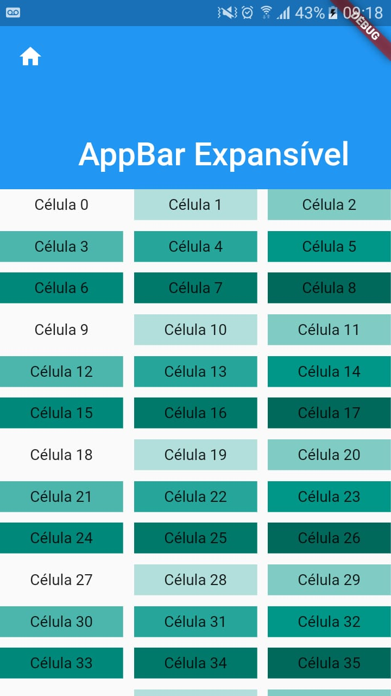

# CustomScrollView - Grid, Scroll e AppBar Expasível

Nesse tutorial vamos aprender a fazer uma AppBar Expasível e um ScrollView com components de diferentes tamanhos no seu conteúdo. 

Para construir essa estrutura de tela nós vamos utilizar basicamente o componente `CustomScrollView` as variantes do Sliver, como `SliverAppBar`, `SliverFixedExtentList` e `SliverGrid`.

Vamos definir a estrura básica do nosso App:

```dart
import 'package:flutter/material.dart';

void main() => runApp(new MyApp());

class MyApp extends StatelessWidget {
  @override
  Widget build(BuildContext context) {
    return new MaterialApp(
      home: Scaffold(
        body: MyCustomScroll()
      ),
    );
  }
}

class MyCustomScroll extends StatelessWidget {
  @override
  Widget build(BuildContext context) {
    return CustomScrollView(
      slivers: <Widget>[]  
    );
  }
}
```

Com essa estrutura básica do nosso App vamos começar tabalhar nos detalhes. Nosso primeiro passo é aprender usar o `SliverAppBar`. Dentro do array de __slivers__ no `CustomScrollView` vamos adicionar o `SliverAppBar`, da seguinte forma:

```dart
    ...
    slivers: <Widget>[
      SliverAppBar(
        pinned: true,
        expandedHeight: 150.0,
        leading: Icon(Icons.home),
        flexibleSpace: FlexibleSpaceBar(
          title: Text('AppBar Expansível'),
        ),
      ),
    ]
```
Dessa forma já temos uma `AppBar` com o tamanho máximo de 150 pixels, ícone de home no canto superior e um texto flutuante. Várias outras propriedades podem ser exploradas tanto em `SliverAppBar` como em `FlexibleSpaceBar`. Mas por enquanto vamos nos ater a somente essas.

Agora vamos utilizar um componente um pouco mais complexo. Na verdade, não é tão complicado assim. Mas vamos precisar entender melhor os detalhes para uma melhor utilização do desse componente. Logo abaixo de `SliverAppBar` vamos adicionar o `SliverGrid`, como segue:

```dart
    slivers: <Widget>[
      // Código anterior
      SliverAppBar(
        pinned: true,
        expandedHeight: 150.0,
        leading: Icon(Icons.home),
        flexibleSpace: FlexibleSpaceBar(
          title: Text('AppBar Expansível'),
        ),
      ),
      // Início do novo código
      SliverGrid(
        gridDelegate: SliverGridDelegateWithMaxCrossAxisExtent(
          maxCrossAxisExtent: 250.0,
          mainAxisSpacing: 10.0,
          crossAxisSpacing: 10.0,
          childAspectRatio: 4.0,
        ),
        delegate: SliverChildBuilderDelegate(
          (BuildContext context, int index) {
            return Container(
              alignment: Alignment.center,
              color: Colors.teal[100 * (index % 9)],
              child: Text('Célula $index'),
            );
          },
          childCount: 100,
        ),
      ),
      // Fim do novo código
    ]
```
A propriedade __gridDelegate__ utiliza um `SliverGridDelegateWithMaxCrossAxisExtent` para gerenciar a forma como os componentes serão distribuidos na tela no grid. Vamos detalhar cada propriedade.

- __maxCrossAxisExtent__: Define o máximo que cada célula do grid poderá crescer no eixo transvesal ao do grid, ou seja, se o grid é vertical (que é o padrão) o máximo do tamanho horizontal do exemplo acima é 250 pixels. Para deixar mais claro, vamos imaginar uma tela com scroll vertical e largura de 400 pixels. Se o _maxCrossAxisExtent_ for igual 200 então o grid terá 2 colunas de, no máximo, 200 pixels cada, caso o _maxCrossAxisExtent_ seja 100 o grid terá 4 colunas de, no máximo, 100 de largura cada, se o _maxCrossAxisExtent_ for maior que 200 pixels aí teremos apenas 2 colunas com a largura de 200 pixels ou menos.
- __mainAxisSpacing__: É o espaçamento na direção do eixo principal do grid. Exemplo, se o grid é vertical e o _mainAxisSpacing_ é 30 pixels então o espaçamento entre as linhas será 30 pixels. Se o grid é horizontal e o _mainAxisSpacing_ é 40 pixels então esse será o espaçamento entre as colunas.
- __crossAxisSpacing__: Essa propriedade é semelhante _mainAxisSpacing_ mas é no eixo transversal a do grid.
- __childAspectRatio__: Essa é a propriedade é mais interessante, é ela que define o tamanho da célula do grid. Até agora vimos como calcular a largura e o espaçamento de cada célula do grid, mas o tamanho aparece como? É justamente o _childAspectRatio_ que calcula isso baseado na razão dada. Ou seja, se a razão for 4, então teremos a altura 1/4 da largura. Se o _childAspectRatio_ for 0.5 então teremos a altura com 1/0.5 da largura, ou seja, a altura será o dobro da largura.

Perceba que nesse componente o conteúdo de cada célula não gerencia o tamanho da célula, essa responsabilidade é inteiramamente do _grid_. O conteúdo que está na célula deverá se comportar baseado no tamanho da célula.

Já na propriedade __delegate__ foi passado o `SliverChildBuilderDelegate` que vai gerar 100 células para o _grid_, como passado no _childCount_ e cada célula terá um `Container` com cor e texto variante dependendo do _index_ do `Container`.

Resultado final do App:


